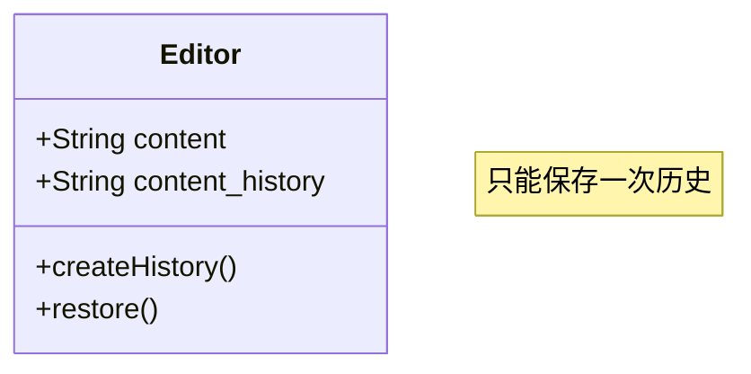
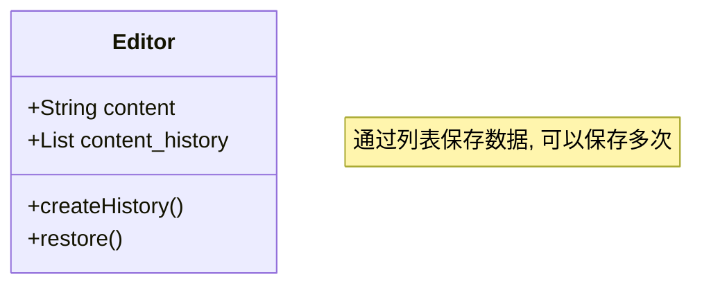
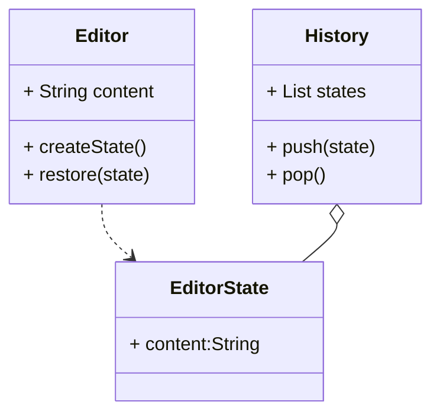

## 应用场景

主要应用在类似于撤销操作的应用场景之中.

假设存在一个文本编辑器, 要对其编辑历史进行记录, 以实现撤销操作

如果使用简单的设计方法, 可以让编辑器包含一个历史记录字段, 用以储存上一次的内容.



但是问题在于仅能保存一次历史记录. 可以修改成



虽然可以保存多次了, 但是本质上来说, 历史记录并不是Editor应该要关心的事.

也就是违反了`SRP(Single Responsibility Principle)`原则.

使用备忘录模式(memento pattern)的方案大致如下:



* Editor 仅负责处理当前编辑的内容;
* History 只进行历史数据管理;
* EditorState 仅保存单词的历史信息

python模拟代码:

```python
from collections import namedtuple

EditorState = namedtuple('EditorState', ['title', 'content'])


class History:

    __history = []

    def push(self, record: EditorState):
        self.__history.append(record)

    def pop(self):
        return self.__history.pop()


class Editor:

    def __init__(self, title=None, content=None):
        self.__title = title
        self.__content = content

    @property
    def title(self):
        return self.__title

    @title.setter
    def title(self, value):
        self.__title = value

    @property
    def content(self):
        return self.__content

    @content.setter
    def content(self, value):
        self.__content = value

    def restore(self, state: EditorState):
        self.title = state.title
        self.content = state.content

    def create_state(self):
        return EditorState(self.title, self.content)

    def __str__(self):
        return f"{self.title}:{self.content}"


if __name__ == "__main__":

    editor = Editor()
    history = History()

    editor.title = "title 1"
    editor.content = "content of editor 1"
    history.push(editor.create_state())
    print(editor)   # title 1:content of editor 1

    editor.title = "title 2"
    editor.content = "content of editor 2"
    history.push(editor.create_state())
    print(editor)   # title 2:content of editor 2

    editor.title = "title 3"
    editor.content = "content of editor 3"
    print(editor)   # title 3:content of editor 3

    editor.restore(history.pop())
    print(editor)   # title 2:content of editor 2
```
