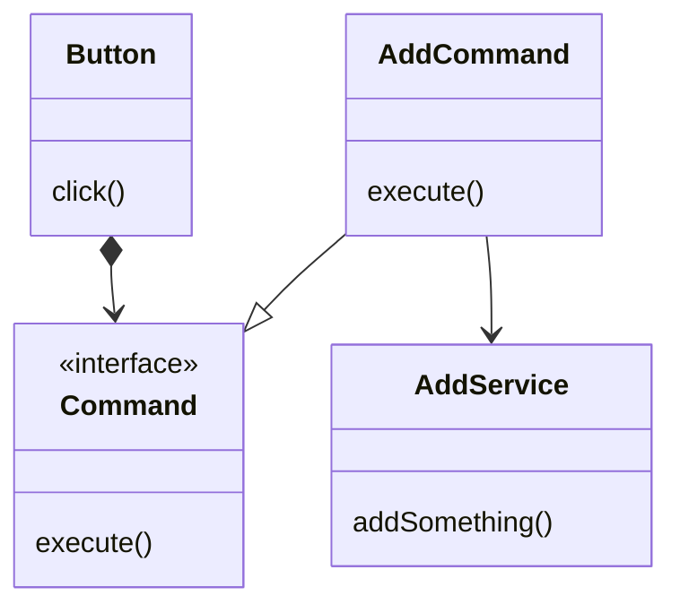

## 应用场景

假设在编写一个UI框架, 框架中包含一个按钮对象Button, 当点击按钮时则会执行一些指令.

为了能够实现框架与功能的解耦, 通常便会使用命令模式.

* 按钮点击时会调用命令接口的执行命令
* 实现接口的对象则依靠多态指派
* 实现接口的实际指令对象仅负责将指令派发至具体的功能实现类
* 最终由实现类完成指令



通过这个结构可以看出来, 框架中的`Button`对于具体业务`AddService`是完全隔离的.

业务本身不依赖任何框架, 也就是可以对接任何框架

而`AddCommand`则是用来链接框架和具体业务的派发对象. 当需要更换框架的时候也只需要换个派发对象也就是了.

简单的python实现:

```python
import abc


# Framework
class Command(abc.ABC):

    @abc.abstractmethod
    def execute(self):
        pass


class UIControl(abc.ABC):

    @abc.abstractmethod
    def draw(self):
        pass

    @abc.abstractmethod
    def action(self):
        pass


class Button(UIControl):

    def __init__(self, cmd: Command = None):
        self.__cmd = cmd

    def draw(self):
        print("draw Button")

    def click(self):
        self.action()

    def action(self):
        if self.command:
            self.command.execute()

    @property
    def command(self):
        return self.__cmd

    @command.setter
    def command(self, value):
        if isinstance(value, Command):
            self.__cmd = value


# Project using Framework above.
class AddButton(Button):

    def __init__(self):
        super().__init__(AddCommand())

    def draw(self):
        print("draw add button.")


class Service(abc.ABC):

    @abc.abstractmethod
    def perform(self):
        pass


class AddService(Service):

    def perform(self):
        self.__add_somethine()

    def __add_somethine(self):
        print("add something to somewhere...")


class BasicCommand(Command):

    def __init__(self, service: Service):
        self.__service = service

    def execute(self):
        self.__service.perform()


class AddCommand(BasicCommand):

    def __init__(self):
        super().__init__(AddService())


if __name__ == "__main__":
    btn = AddButton()
    btn.draw()
    btn.click()

```
