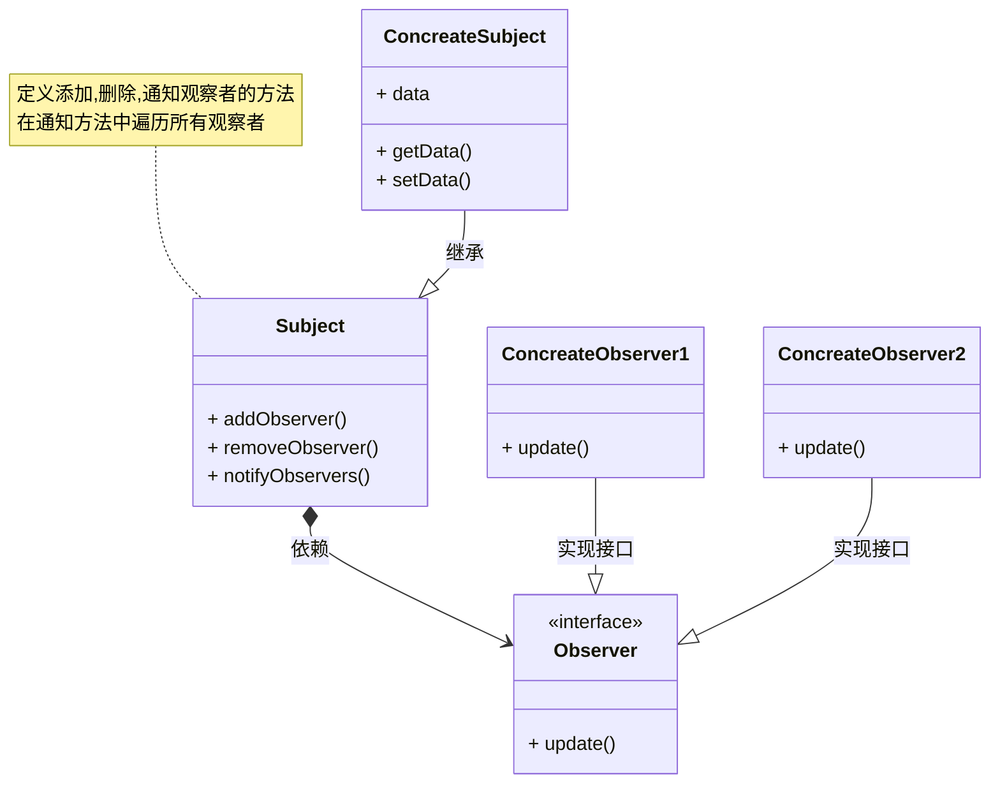

## 应用场景

类似于图表的应用场景, 有一个包含原始数据的表格, 以及一张基于表格内的数据绘制的图表.

当表格内的数据发生变动时, 图表就应该给予数据进行重绘.

观察者模式就是设置一个对原始数据的观察者, 当原始数据发生变动时, 由观察者负责通知所有依赖这些数据运行的其他对象发生了变动以及具体的变动内容.



## 简单的python实现

```python

from abc import ABC, abstractmethod
from enum import Enum


class ObserverPayloadTypeKey(Enum):
    OLD = 1
    NEW = OLD << 1

    def __or__(self, other):
        return self.value | other.value

    def __and__(self, other):
        if isinstance(other, int):
            return self.value & other
        return self.value & other.value


class Observer(ABC):
    @abstractmethod
    def update(self, key: str, payload):
        """
        观察者回调函数, 在被观察对象的`key`属性发生变化时调用.

        Args:
            key: 发生变化的属性名
            payload: 包含属性变化值的词典, 
            通过`ObserverPayloadTypeKey.OLD`和`ObserverPayloadTypeKey.NEW`获取更新前后的数据.
        """


def notify(payload_type=ObserverPayloadTypeKey.OLD | ObserverPayloadTypeKey.NEW):
    """
    标记属性为通知属性, 被标记的属性在更新时会自动通知观察者对象. 默认会同时向观察者发送更新前和更新后的数据.
    观察者对象需要实现`Observer`接口中的的`update(self, key, payload)`方法

    通过`payload[ObserverPayloadTypeKey.NEW]`可以获得更新后的值


    Example:
        @title.setter
        @notify()
        def title(self, value):
            self.__title = value

    Note:
        需要在@property.setter装饰器之前使用.

    Args:
        payload_type (ObserverPayloadTypeKey, optional): 
            枚举类型的标记, 用以标记通知发送数据的类型. 
            默认为: `ObserverPayloadTypeKey.OLD | ObserverPayloadTypeKey.NEW`
            即同时包含修改前后的值.
    """
    def decorator(func):
        def warpper(*args, **kwargs):
            key = func.__name__
            payload = {ObserverPayloadTypeKey.NEW: args[1]}
            observers = getattr(args[0], "_Observable__observers").items()
            if ObserverPayloadTypeKey.OLD & payload_type:
                payload[ObserverPayloadTypeKey.OLD] = getattr(
                    args[0], key)
            for ob_key, observer in observers:
                if ob_key.startswith(key):

                    observer.update(key, payload)
            func(*args, **kwargs)
        return warpper
    return decorator


class Observable:
    """
    可以被监听的对象, 子类需要显示的的调用父类的构造函数
        
        def __init__(self, your, args):
            super().__init__()
            # ...
        
    通过对属性的setter方法添加装饰器`@notify()`可以在属性更新时通知观察者对象.
    """

    def __init__(self):
        self.__observers = {}

    def __create_observer_key(self, ob, key):
        return f"{key}_{ob.__hash__()}"

    def add_observer(self, observer: Observer, key: str):
        observer_key = self.__create_observer_key(observer, key)
        if observer_key not in self.__observers:
            self.__observers[observer_key] = observer

    def remove_observer(self, observer: Observer, key: str):
        observer_key = self.__create_observer_key(observer, key)
        if observer_key in self.__observers:
            del self.__observers[observer_key]


class Post(Observable):

    def __init__(self, title, body):
        super().__init__()
        self.__title = title
        self.__body = body

    @property
    def title(self):
        return self.__title

    @title.setter
    @notify()
    def title(self, value):
        self.__title = value

    @property
    def body(self):
        return self.__body

    @body.setter
    @notify()
    def body(self, value):
        self.__body = value


class PostObserver(Observer):

    def update(self, key, payload):
        print(f"Observing Post `{key}` has been changed ")
        print(f"\tfrom: `{payload[ObserverPayloadTypeKey.OLD]}`")
        print(f"\tto: `{payload[ObserverPayloadTypeKey.NEW]}`.")


if __name__ == "__main__":
    post = Post('title', 'some text')
    observer = PostObserver()
    post.add_observer(observer, 'title')
    post.add_observer(observer, 'body')

    post.title = 'new title'
    post.body = 'new body'
```

输出结果:
```bash
Observing Post `title` has been changed 
    from: `title`
    to: `new title`.
Observing Post `body` has been changed 
    from: `some text`
    to: `new body`.
```

## 后记

这个demo算是开始学习设计模式以来写的最耗时的一个了.

虽然通过简单的方法来处理观察者的通知要比这么实现简单的多, 但是同样的, 越简单的实现应用起来就越麻烦.

相比于在每一个属性的`setter`里都要显示的调用通知函数, 一个无需额外操作的装饰器他不香么.

也就因为这一个想法, 溜溜耗了一下午才给这东西折腾完.

但就装饰器的问题都可以单独拿出来做一篇笔记了.

虽然功能算是实现了, 但是肯定还有不完善的地方. 比如一次性为多个属性添加观察者什么的.

姑且留个念想, 放在以后得实际项目里再完善吧.
