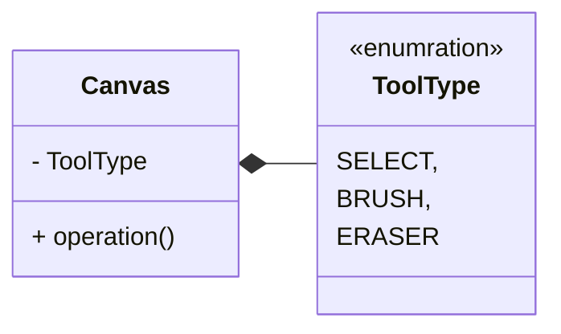
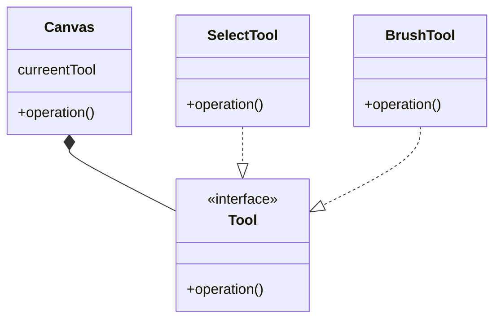

## 应用场景

当执行同一种操作时基于不同的状态出现不同的效果.

比如在画图软件中, 如果选中了画笔, 按住鼠标在画布上拖动就会绘制线条.

如果选中了选择工具, 按住鼠标在画布上拖动就会出现一个选择框.

对于鼠标的操作行为是相同的, 但是基于选中工具的状态不同, 则会执行不同的操作.

## 基础实现方式

可以创建一个枚举类, 用来列出所有的工具类型, 然后让画布包含一个枚举成员, 并在操作时判断这个成员的值.



简单模拟代码如下:

```python

class ToolType(Enum):
    SELECT = 1
    BRUSH = 2
    ERASE = 3


class Canvas:

    def __init__(self, tool_type=ToolType.SELECT):
        self.__tool_type = tool_type

    def operation(self):
        if self.__tool_type == ToolType.SELECT:
            print("using select tool ")
        elif self.__tool_type == ToolType.BRUSH:
            print("using brush tool ")
        elif self.__tool_type == ToolType.ERASE:
            print("using erase tool ")

if __name__ == "__main__":
    canvas = Canvas()
    canvas.operation()
    canvas.tool_type = ToolType.BRUSH
    canvas.operation()            
```

但问题显而易见, 当工具增多时既要维护大量的枚举类型, 还要维护大量的枚举判断, 使得代码难以阅读, 极大的增加了维护成本.

## 使用状态设计模式解决

状态模式的本质是通过运行时的多态来完成不同状态下的不同操作.



如此一来, 如果在任何时候希望添加一个新的工具, 直接创建一个新的类来实现`Tool`接口即可以完成对程序的扩展, 而无需再修改原有的代码逻辑.

事实上, 所有需要通过类似`select...case`或者大量`if...else if`判断的场景都可以通过状态模式来解决.

状态设计模式, 也是`OCP(Open Closed Principle)`的一种体现, 即对扩展开放, 但是对修改关闭.

* open for extension
* closed for modification

简单的python实现代码:

```python
import abc


class Tool(abc.ABC):

    @abc.abstractmethod
    def operation(self):
        pass


class SelectTool(Tool):

    def operation(self):
        print("select something...")


class BrushTool(Tool):

    def operation(self):
        print("brush something...")


class Canvas:

    def __init__(self, tool=None):
        self.__tool = tool or SelectTool()

    @property
    def tool(self):
        return self.__tool.__str__

    @tool.setter
    def tool(self, value: Tool):
        self.__tool = value

    def operation(self):
        self.__tool.operation()


if __name__ == "__main__":
    canvas = Canvas()
    canvas.operation()
    canvas.tool = BrushTool()
    canvas.operation()
```
