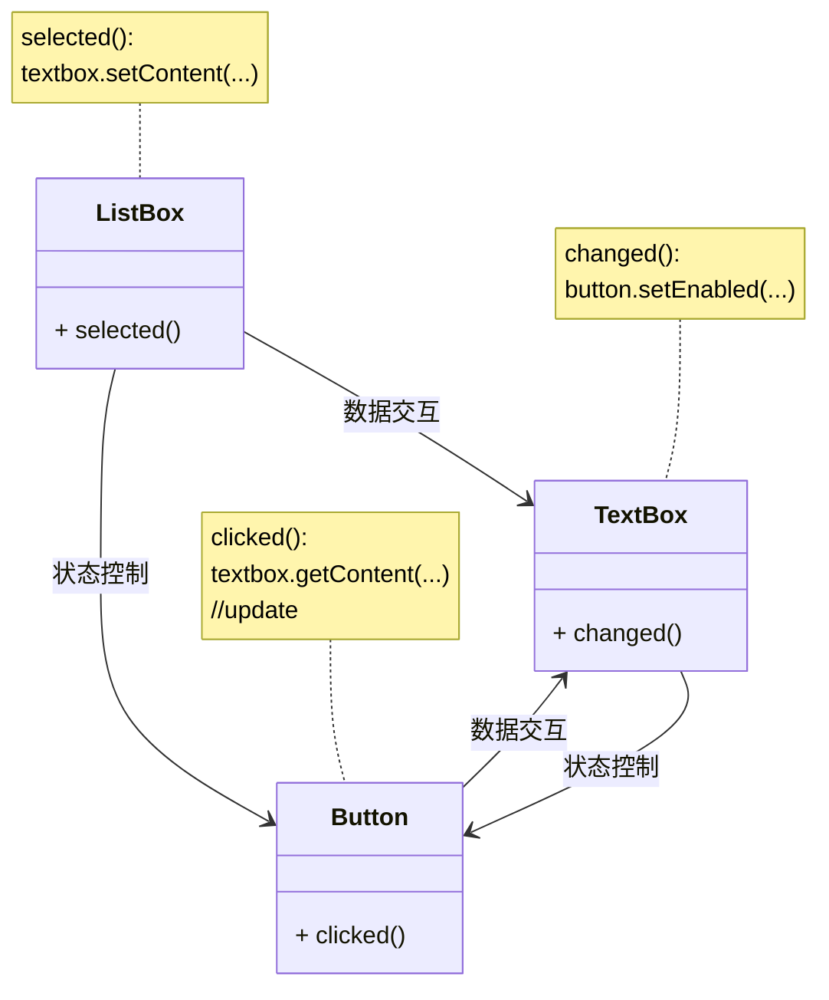
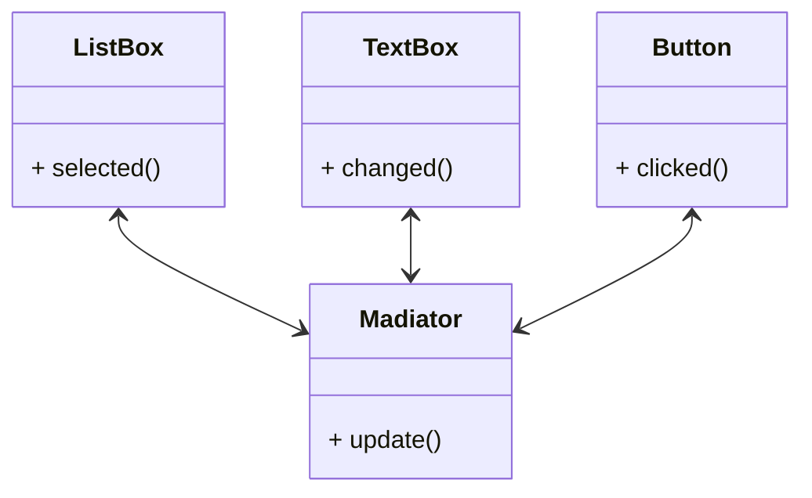

## 应用场景

通常用于多个元素之间的统一通信调度. 举例来说, 一个用户界面拥有多个类型的UI:

* ListBox
* TextBox
* button

当选中listbox中的项时同步修改textbox中的文字. 而当textbox中包含文字时按钮可用, 当textbox中的文字为空时按钮不可用.



虽然功能不复杂, 但是相互之间的连线却是不少. 如果只是单纯的进行UI罗列, 同时直接在UI之间进行交互, 一旦UI数量增多, 就会变得相当难以维护.

中介模式便是为了应对这一问题, 通过一个中介类管理所有的交互状态, 使不同的UI之间彼此隔绝.



任何一个UI的状态发生改变, 仅需要通知中介对象, 至于其他UI应该做什么对应的调整发生变动的UI本身不需要关心, 也就有了逻辑统一的管理和维护.

## 简单的python实现

```python
from abc import ABC, abstractmethod


class DialogBox(ABC):

    @abstractmethod
    def update(self, src, payload=None):
        pass


class UIControl(ABC):

    __owner = None

    def __init__(self, name, title=None):
        self.is_enabled = True
        self.name = name
        self.title = title

    @abstractmethod
    def draw(self):
        pass

    @property
    def owner(self) -> DialogBox:
        return self.__owner

    @owner.setter
    def owner(self, value: DialogBox):
        self.__owner = value


class UIButton(UIControl):

    def draw(self):
        print("draw button")

    def click(self):
        if self.owner:
            self.owner.update(self)

        print("click button")


class UITextBox(UIControl):

    def __init__(self, name, content=None):
        self.__content = content
        super().__init__(name)

    def draw(self):
        print("draw text box")

    def text_changed(self):
        if self.owner:
            self.owner.update(self)
        print("text changed")

    @property
    def content(self):
        return self.__content

    @content.setter
    def content(self, value):
        self.__content = value
        self.text_changed()


class UIListBox(UIControl):

    def __init__(self, name, *items):
        self.__items = items
        super().__init__(name)
        self.__selected = -1

    def on_selected(self, index):
        print(f"selected item on index: {index}")
        if self.owner:
            self.owner.update(self)

    @property
    def selected(self):
        return None if self.__selected == -1 \
            else (self.__selected, self.items[self.__selected])

    @selected.setter
    def selected(self, value):
        if value > 0 and self.__selected != value:
            self.__selected = value
            self.on_selected(value)

    @property
    def items(self):
        return self.__items

    @items.setter
    def items(self, value):
        self.__items = value

    def draw(self):
        print("draw listbox")


class DemoPageDialog(DialogBox):

    def __init__(self, *ui_list):
        self.__ui_list = ui_list
        for ui in ui_list:
            if isinstance(ui, UIControl):
                ui.owner = self

    def update(self, src: UIControl, payload=None):
        if src not in self.__ui_list:
            return

        if isinstance(src, UIButton):
            print(">> save text to database...")
        elif isinstance(src, UITextBox):
            print(f">> textbox content change to {src.content}")
            print(">> set button enabled...")
        elif isinstance(src, UIListBox):
            print(f">> listbox selected on:{src.selected}")


if __name__ == "__main__":

    btn = UIButton("btn")
    txt = UITextBox("title")
    listbox = UIListBox("list", "title1", "title2", "title3")

    DemoPageDialog(btn, listbox, txt)

    listbox.selected = 1
    txt.content = "new content..."
    btn.click()

```

输出结果:

```bash
selected item on index: 1
>> listbox selected on:(1, 'title2')
>> textbox content change to new content...
>> set button enabled...
text changed
>> save text to database...
click button
```
