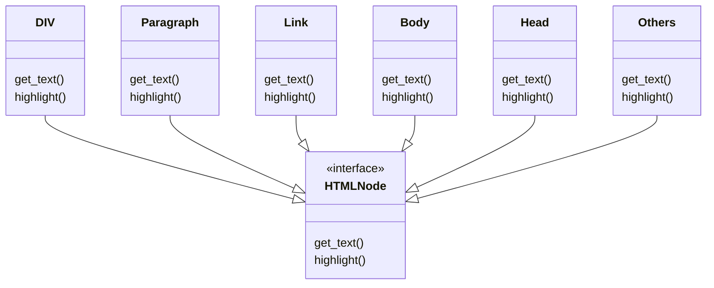
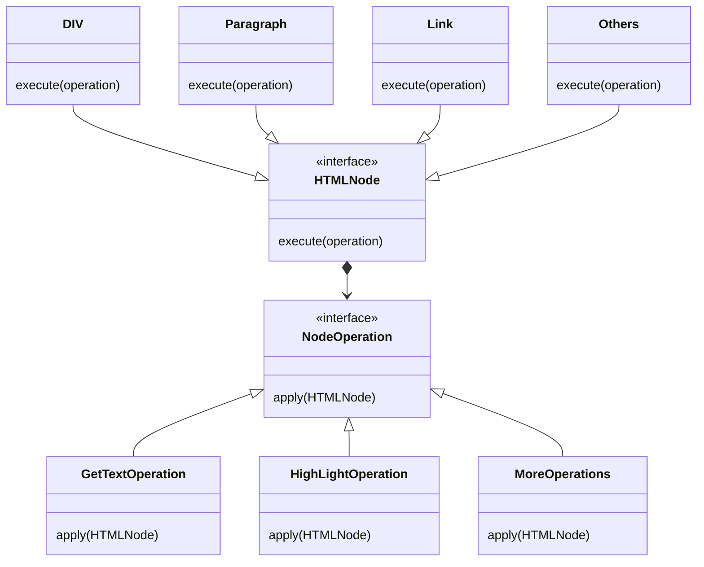

## 应用场景

访问者模式最常见的应用场景在于对已有功能的扩展. 假设有这样一套类:



定义一个`HTMLNode`, 然后定义各种类型的HTML标签对应的类来继承该接口. 从结构上来讲并没有什么问题.

但会存在两个问题:

1. 在编码的过程中需要再所有的子类中实现接口中的方法, 通常伴随着大量的重复内容.
2. 如果忽然有一天发现接口需要增加某个功能, 那直接面对的就是一堆的编译错误. 因为所有实现了这个接口的类都必须单独重新实现这一新增的接口方法. 显然违背了开关原则.

这时就可以考虑使用访问者模式, 不将新方法添加到接口里, 而是让接口依赖于另外一个管理操作的接口, 由其具体实现对象来进行不同的操作. 大致结构如下:



如此一来便将对象和操作进行了分离, 当希望对象能够执行新的操作时也不需要对对象本身进行修改, 而是通过扩展`Operation`的实现类即可完成.

就好比身为汽车人领袖的擎天柱, 出厂设定时苦哈哈的实现了汽车人接口, 从此要么腿儿着要么滚着~

遥望翱翔天际的好兄弟威震天, 心里想着什么时候咱爷们儿也能体验一把飞一般的赶脚~嘴上还是得跟伙计们高声呐喊, Autobots! Roll out!

恰逢好兄弟威震天的小老弟天火到访, 那真是打瞌睡掉枕头~咱擎爷一点不含糊, 下手干净利索快, `execute`了天火老爷子就给自己`apply`上了~~出厂标配不会飞? 那都不叫事儿~


别跟我说电影里是天火老爷子给自己拆了, 不光历史是个任人打扮的老娘...小姑娘, 电影也一样~

咱擎爷那是正面人物! 这种浓眉大眼的正面人物怎么能叛变革命呢!

于是擎爷名正言顺的拾取了顶级飞行套件天火套装~~穿了一次飞没多远发现自己晕高, 落地就给扔了~

突出一个拔那啥无情.

你说就这顶配版渣男的造型, 要是哪天想穿个皮草了? 超能勇士不得变成下一个大冤, 不是, 下一个为了正义牺牲的大英雄了.

也就俩人邂逅在热带, 保不齐皮厚了对发动机散热不好. 这家伙要来趟东北?


## 简单的python实现

```python
from abc import ABC, abstractmethod


class Parts(ABC):

    @abstractmethod
    def apply(self, target, *args, **kwargs):
        pass


class Autobot(ABC):

    def __init__(self, name, slogan=None):
        self.name = name
        self.slogan = slogan
        self.flyable = False

    @abstractmethod
    def rolling(self):
        pass

    def powerup(self, part: Parts):
        part.apply(self)


class Prime(Autobot):

    def __init__(self):
        super().__init__("OPtimus Prime", "Freedom is everyone's right.")

    def rolling(self):
        if self.flyable:
            print(self.name + ' is ro~ro~的.')
        else:
            print(self.name + " is rolling out~!")

    def powerup(self, part: Parts):
        part.apply(self)
        print(f">> {self.name}: You will always live in our memory.")


class Bumblebee(Autobot):

    def __init__(self):
        super().__init__("Bumblebee", "bi...")

    def rolling(self):
        print("bi bi di di ga...")


class JetFire(Parts):

    def apply(self, target, *args, **kwargs):
        if isinstance(target, Autobot):
            print(f">> JetFire: {target.name}! 我$%^&*...")
            target.flyable = True
            print(
                f">> NOTICE: {target.name} picked up JetFire Suit! He can fly now!")


if __name__ == "__main__":
    prime = Prime()
    prime.rolling()
    prime.powerup(JetFire())
    prime.rolling()

```

嗯...输出结果:

```bash
Optimus Prime is rolling out~!
>> JetFire: OPtimus Prime! 我$%^&*...
>> NOTICE: OPtimus Prime picked up JetFire Suit! He can fly now!
>> OPtimus Prime: You will always live in our memory.
OPtimus Prime is ro~ro~的.
```
