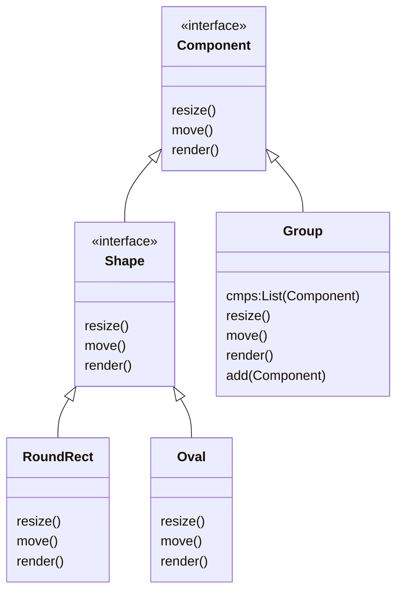

## 应用场景

在使用类似于PowerPoint, Keynot等软件时经常会处理一些简单的图形, 或者具有关联关系的各种元素.通常情况下, 我们会把他们放入一个组中.

之后在对组进行操作的时候, 比如移动, 缩放一类的, 组中的所有元素就会一同执行这些操作.

又或者文件夹和文件的关系, 在复制, 移动, 删除文件夹的时候其中的所有文件都会被一同操作.

当在程序中处理类似问题的时候可以通过一个组对象来保存同组的其他对象, 并在执行某一方法的时候对所有组内的对象一并执行.



这样所有的形状都是Component, 而组也同样是Component, 这也就意味着元素和组有这相同的通讯方式.

对单一元素进行操作,调用自身的接口方法, 而对组进行操作, 组直接调用自身子元素的对应方法即可, 无论子元素是组还是具体元素.

也就实现了无论对于单一元素还是元素组合的相同操作模式.

## 简单的python实现

```python
from abc import ABC, abstractmethod
from enum import Enum


class Excuteable(ABC):

    @abstractmethod
    def attack(self, target):
        pass

    @abstractmethod
    def return_to_base(self):
        pass

    @abstractmethod
    def destroy(self):
        pass


class MarkSeries(Excuteable):

    class Status(Enum):
        STAND_BY = 1
        FIGHTING = 2
        REPAIRING = 3
        CHARGING = 4

    def __init__(self, name=None):
        self.name = name or "Mark Prototype"
        self.attack_power = 100
        self.heath_point = 1000
        self.status = MarkSeries.Status.STAND_BY
        self.weapon = "biu~biu~biu~"

    def attack(self, target):
        print(
            f"{self.name} {self.weapon} on `{target}` cause `{self.attack_power}` damage.")

    def return_to_base(self):
        print(f"{self.name} is retreat.")

    def destroy(self):
        print(f"{self.name} is exploded. peng~")


class Mark2(MarkSeries):

    def __init__(self):
        super().__init__("Mark II")
        self.attack_power += 20
        self.heath_point += 200
        self.weapon = "kuang~kuang~kuang~"


class Mark3(MarkSeries):

    def __init__(self):
        super().__init__("Mark III")
        self.attack_power += 50
        self.heath_point += 500
        self.weapon = "ka~ka~ka~"


class Formation(Excuteable):

    def __init__(self, *units):
        self.units = units or []

    def add_unit(self, unit):
        self.units.append(unit)

    def remove_unit(self, unit):
        if unit in self.units:
            self.units.remove(unit)

    def attack(self, target):
        for unit in self.units:
            unit.attack(target)

    def return_to_base(self):
        for unit in self.units:
            unit.return_to_base()

    def destroy(self):
        for unit in self.units:
            unit.destroy()


if __name__ == "__main__":
    boss = "Thanos"
    m2 = Mark2()
    m3 = Mark3()

    m2.attack(boss)
    m3.attack(boss)

    form = Formation(m2, m3)

    form.attack(boss)
    form.return_to_base()
    form.destroy()
```
