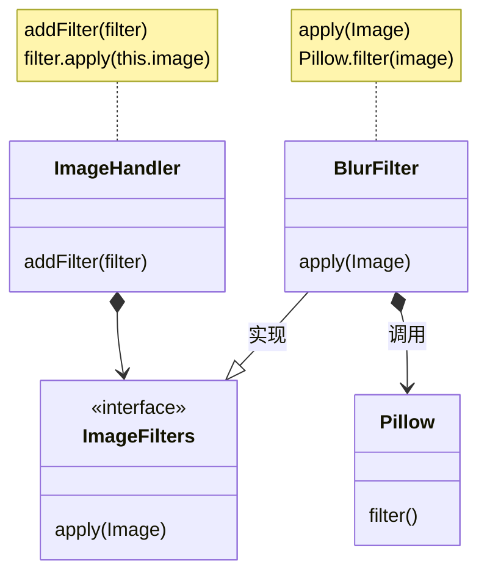

## 应用场景

适配器模式属于比较常见且比较容易理解的设计模式.

老话说的好, 0.5的铅芯是不能用在0.7的自动笔里的.

当在项目里为了实现某些功能并应用某种设计模式, 或其他什么原因需要设计一些接口, 而这些接口的实现类要做的具体业务需要依赖于某个外部项目.

比如需要再自己的项目中加入图片处理的一些功能. 需要用到开源的图像处理库.
再比如在处理数据库ORM的时候针对不同的数据库需要有不同的实现.

这时候就可以应用适配器模式.



## 简单的python实现

```python
from abc import ABC, abstractmethod


class ImageFilters(ABC):

    @abstractmethod
    def apply(self, image):
        pass


class ImageHandler:

    def __init__(self, image=None):
        self.image = image or "Some PNG file"

    def add_filter(self, *image_filter):
        for f in image_filter:
            if isinstance(f, ImageFilters):
                f.apply(self.image)


class Pillow():

    def blur_filter(self, image):
        print(f"fake image filter in Pillow lib is bluring `{image}`.")


class BlurFilter(ImageFilters):

    def apply(self, image):
        pillow = Pillow()
        pillow.blur_filter(image)


if __name__ == "__main__":
    handler = ImageHandler("SoHot.png")
    handler.add_filter(BlurFilter())

```
