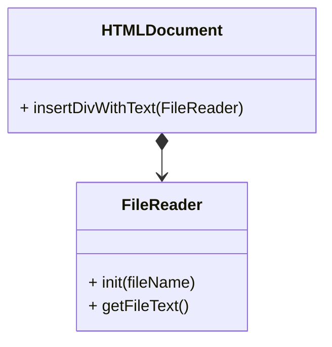
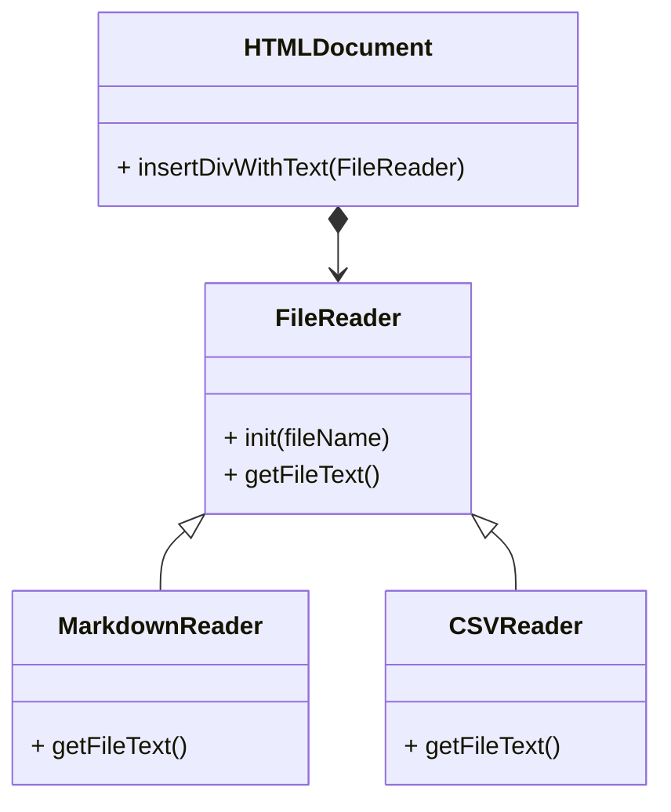
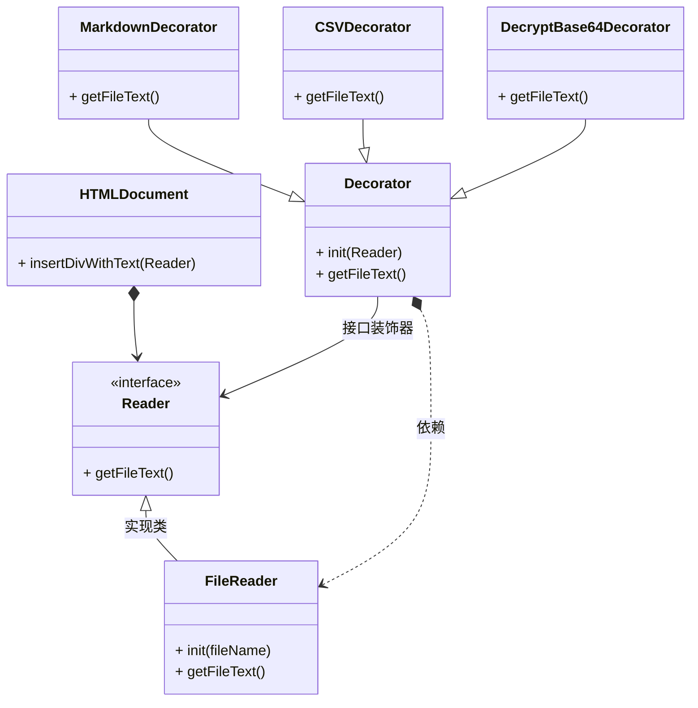

## 问题描述

装饰器是python语言中相当重要的一部分. 但装饰器本身并不是python都有的东西. 只是一种设计模式, 本质上可以由任何语言实现.

假设在`HTMLDocument`类中有一个方法, 可以接收一个文本文本文件, 并用`<div>`标签将其包裹并放在html文件中.



通过文件操作读取文件名, 获取文件内容, 只要保存的是文本格式的内容都可以进行读取.

也就是说`txt`,`md`,`csv`,又或者`html`文件都可以通过`FileReader`读取.

在调用`insertDivWithText`方法时只需要调用参数`FileReader`对象的`getFileText`方法, 将其用`div`标签包裹然后插入到文件中就可以了.

但实际操作中难免会遇到更为复杂的需求. 比如:

* 把Markdown格式的文本转换为html格式的文本.
* 将csv文件的内容做成html表格然后放到div中.

如果采用策略模式, 在不修改HTMLDocument的情况下, 可以创建MarkdownReader和CSVReader来解决这个问题.



用python简单实现以下当前的描述:

```python
class FileReader:

    def __init__(self, file_name):
        self.file_name = file_name

    def get_file_text(self):
        return f"content text of file `{self.file_name}`"


class HTMLDocument:

    def insert_div_with_text(self, reader: FileReader):
        print(reader.get_file_text())


class MarkdownReader(FileReader):

    def get_file_text(self):
        text = super().get_file_text()
        return f"html text parsed from text: `{text}` in file `{self.file_name}`"


class CSVReader(FileReader):

    def get_file_text(self):
        text = super().get_file_text()
        return f"html table parsed from text: `{text}` in file `{self.file_name}`"


if __name__ == "__main__":
    doc = HTMLDocument()
    md_reader = MarkdownReader('demo.md')
    doc.insert_div_with_text(md_reader)
```

现在看来, 从结构上来说是没有问题的, 策略模式可以应对这种变动的需求.

通过FileReader基类或者接口, 进行不同类型文件的扩展, 并重写`get_file_text`方法以获得正确的html字符串就可以了.

假设新增了一个需求:

* 将文本文件中通过base64加密的文本文件解密

问题不大, 我们可以直接添加一个`Base64Reader`来解决问题.

跟着新的需求有来了, base64解密之后的文件是一个markdown格式的文本. 除了解密之外还要把markdown文本转换成带格式的html.

安排, 一个新的类又被扩展出来, `Base64MarkdownReader`.

这时候就已经能够初步看到问题了, 因为在之前的代码中, 已经包含了base64解密的策略, 有了mardown解析的策略, 但是当两个需求合并的时候, 便不得不重新为其编写新的策略.

而这每一次为新策略的编码都是毫无疑问的硬编码. 同时已编码的策略是否常用, 是否还会修改也未尝可知. 显然, 在这种情况下应用策略模式并非为一个很好的选择.

装饰器模式便可以更好的解决这一需求.

## 解决方案

装饰器的本质是通过一个包装类或包装方法进行前置或者后置的操作, 然后调用被包装的对象.

而包装类或包装方法在外观上与被包装对象是一致的, 也就可以自然的融入原有的逻辑之中.



这时就可以通过装饰器来进行额外的处理, 并根据需求进行不同的组合了:

```python

doc = HTMLDocument()
reader = MarkdownDecorator(
    DecryptBase64Decorator(
        FileReader('demo.txt')))

doc.insert_div_with_text(reader)
```

此时, `HTMLDocument`并不知道装饰器的存在, 对于他来说操作的已然是一个reader.

而`FileReader`也并没有向策略模式一样进行各种扩展.

`Decorator`则是接受一个Reader对象作为初始化参数, 而自己本身也是一个Reader对象. 并且可以作为参数传递给其他的`Decorator`对象.

## 简单的python实现

```python
from abc import ABC, abstractmethod


class Reader(ABC):

    @abstractmethod
    def get_file_text(self):
        pass


class FileReader(Reader):

    def __init__(self, file_name):
        self.file_name = file_name

    def get_file_text(self):
        return f"content text of file `{self.file_name}`"


class HTMLDocument:

    def insert_div_with_text(self, reader: Reader):
        print(reader.get_file_text())


class BaseDecorator(Reader):

    def __init__(self, reader: Reader):
        self.reader = reader


class MarkdownDecorator(BaseDecorator):

    def get_file_text(self):
        text = self.reader.get_file_text()
        return f"html text parsed from text: \n`{text}`"


class CSVDecorator(BaseDecorator):

    def get_file_text(self):
        text = self.reader.get_file_text()
        return f"html table parsed from text: \n`{text}`"


class DecryptBase64Decorator(BaseDecorator):

    def get_file_text(self):
        text = self.reader.get_file_text()
        return f"decrypt base64 string from text: \n`{text}`"


if __name__ == "__main__":
    doc = HTMLDocument()
    decorator_reader = CSVDecorator(
        DecryptBase64Decorator(
            FileReader('demo.txt')
        )
    )

    doc.insert_div_with_text(decorator_reader)
```

最终输出结果:

```bash
html table parsed from text: 
`decrypt base64 string from text: 
`content text of file `demo.txt```
```
