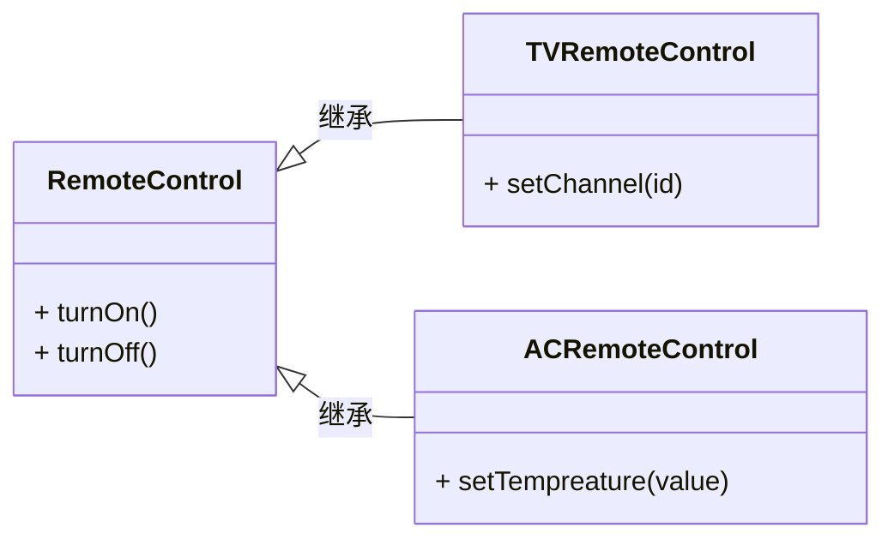
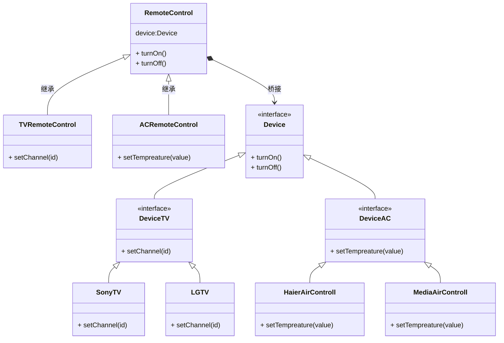

## 问题描述

假设一个智能家居的产品, 要在手机上实现一个遥控器app可以控制所有接入的家电.

大概得结构如下:



每一个具体的实现方法都应该包含几个部分:

* App自身的某些逻辑, 比如用户操作日志, 行为分析, 日志处理等等.
* 创建与设备之间的通讯.
* 创建指令消息.
* 向设备发送指令.

可以简单的为一套加点进行完整的操作抽象.

但如果需要增加新的品牌设备增加适配, 通过继承可以解决问题, 比如添加`TCLTVRemoteControl`类等.

但是对于特定品牌的遥控器所需要的仅仅只是对应的通讯方式. 而继承父类则会完整获得所有的变量和方法, 使得子类变得臃肿.

同时抽象部分于实现部分则通过继承关系耦合度太高, 对父类的任何修改都会影响到全部子类.

也可以使用适配器模式来解决, 不过通常来说, 适配器更多的是用于让两个已经存在的东西协同工作.

桥接模式则是用于将抽象层和实现层分离. 在架好桥之后两边则可以进行独立维护, 实现层也可以自由扩展.



## 简单的python实现

```python
from abc import ABC, abstractmethod


class Device(ABC):

    @abstractmethod
    def turn_on(self):
        pass

    @abstractmethod
    def turn_off(self):
        pass


class Television(Device):

    @abstractmethod
    def set_channel(self, channel):
        pass


class AirController(Device):

    @abstractmethod
    def set_temperature(self, temperature):
        pass


class SonyTV(Television):

    def turn_on(self):
        print("Turn on Sony TV.")

    def turn_off(self):
        print("Turn off Sony TV.")

    def set_channel(self, channel):
        print(f"Set Sony TV to channel:{channel}")


class MediaAirController(AirController):

    def turn_on(self):
        print("Turn on Media Air Controller.")

    def turn_off(self):
        print("Turn off Media Air Controller.")

    def set_temperature(self, temperature):
        print(f"Set Media Air Controller to: {temperature}°C.")


class RemoteController:

    def __init__(self, device: Device):
        self._device = device

    def turn_on(self):
        print("Use Remote Controller to turn on device.")
        self._device.turn_on()

    def turn_off(self):
        print("Use Remote Controller to turn off device.")
        self._device.turn_off()


class TVRemoteController(RemoteController):

    def __init__(self, device: Television):
        super().__init__(device)

    def set_channel(self, channel):
        print(f"Set TV to channel: {channel}")
        if isinstance(self._device, Television):
            self._device.set_channel(channel)


class ACRemoteController(RemoteController):

    def __init__(self, device: AirController):
        super().__init__(device)

    def set_temperature(self, temperature):
        print(f"set AC to temperature: {temperature}°C")
        if isinstance(self._device, AirController):
            self._device.set_temperature(temperature)


if __name__ == "__main__":

    ac = ACRemoteController(MediaAirController())
    tv = TVRemoteController(SonyTV())

    tv.turn_on()
    tv.set_channel(5)
    tv.turn_off()

    ac.turn_on()
    ac.set_temperature(26)
    ac.turn_off()
```

最终输出结果:

```bash
Use Remote Controller to turn on device.
Turn on Sony TV.
Set TV to channel: 5
Set Sony TV to channel:5
Use Remote Controller to turn off device.
Turn off Sony TV.
Use Remote Controller to turn on device.
Turn on Media Air Controller.
set AC to temperature: 26°C
Set Media Air Controller to: 26°C.
Use Remote Controller to turn off device.
Turn off Media Air Controller.
```
