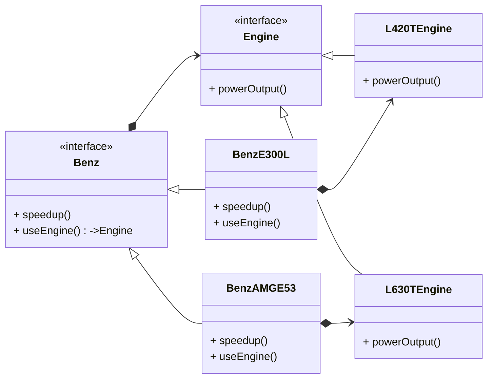

> Defer the creation of an object to sub classes.
>
> 推迟子类中某个对象的创建时间.
>
{: .prompt-info}

这是在设计模式中对工厂方法模式的定位说明.

简单来说, 工厂方法的用法是定义一个接口, 其实现提供某些基类需要的功能. 基类通过工厂方法获得这一接口的实例, 而子类则可以重写该方法以选择其他的实例.

举一个汽车的例子. 奔驰有自己的原厂车, 但是子品牌AMG就提供性能更强的版本.



## 简单的python实现

```python
from abc import ABC, abstractmethod


class Engine(ABC):

    @abstractmethod
    def power_output(self):
        pass


class L420TEngine(Engine):

    def power_output(self):
        return 258


class L630TEngine(Engine):

    def power_output(self):
        return 435


class Benz(ABC):

    def speed_up(self):
        horsepower = self._use_engine().power_output()
        t = 100/(10.6+(horsepower-258)*12.2/177)
        print(f'With {horsepower}hp, 0-100km need {round(t, 2)} seconds.')

    @abstractmethod
    def _use_engine(self):
        pass


class BenzE300L(Benz):

    def _use_engine(self):
        return L420TEngine()


class BenzAMGE53(Benz):

    def _use_engine(self):
        return L630TEngine()


if __name__ == "__main__":

    e300 = BenzE300L()
    e300.speed_up()
    amg = BenzAMGE53()
    amg.speed_up()
```

Benz作为一个抽象类, 实现了大部分的逻辑, 同时把变量部分抽象为接口, 也就是示例中的Engine.

`_use_engine`则扮演了工厂方法角色, 通过该方法返回一个参与业务逻辑所需要的对象.

由于这个对象是`Engine`的实现类, 只需要扩展其他的实现就可以使业务逻辑得到不同的结果.

两个具体车型的子类则是继承自`Benz`抽象类, 重写其工厂方法, 返回其他的实例, 便完成了新的扩展.

> 很多对工厂方法的示例是通过一个工厂对象的静态方法返回一个对象.
>
> 那就是用错了...
>
> 只要工厂在扩展, 工厂类就需要一直维护, 变的越来越臃肿.
>
> 而调用工厂的特定方法也是需要硬编码, 最终变成两边维护.
>
{: .prompt-info}

> **工厂方法是通过继承和重写来快速实现对不同组合的扩展**
>
{: .prompt-tip}
