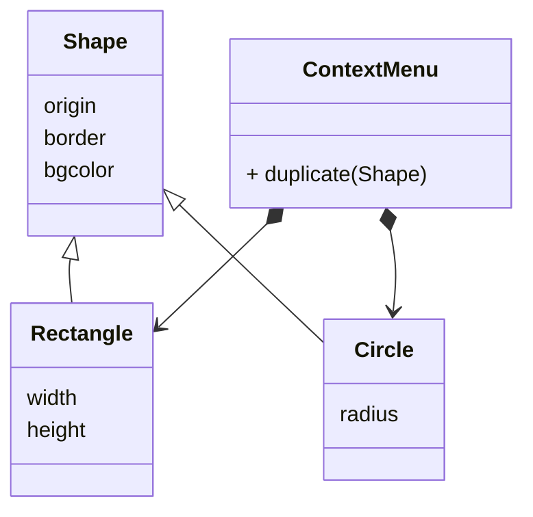
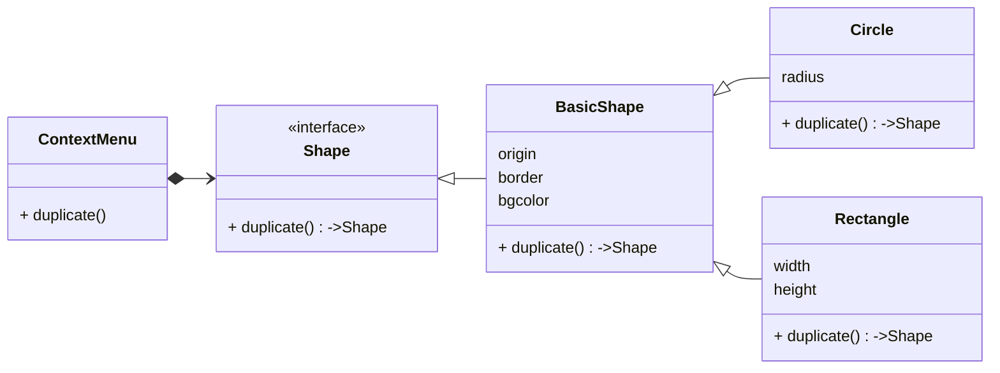

## 应用场景

解决对象的复制问题. 比如在Keynote中有一个图形, 通过右键点击菜单选择副本. 就可以直接得到一个一模一样的图形.

直观的来看, 图形应该有很多种, 可以有一个共同的基类. 而副本命令应该根据不同的图形执行不同的操作.



虽然可以通过这个结构实现功能, 但是问题在于, duplicate方法既要判断究竟是什么类型的形状, 还要针对不同的形状实现复制方法.

这就似的维护成本增高了, 新创建一个形状, 就得同步维护duiplicate方法.

而在原型模式中, 则是直接将duplicate方法定义在shape接口中.



这样一来每个形状各自维护自己的副本方法, 而外部指令不需要关心其内部实现, 只负责与接口交互即可.

本质上来说, 相当于对可能得外部操作通过接口进行了强制要求. 想要成为一个形状, 得先能生成副本.

想当个后端工程师, 得先会几个后台框架, 明白数据库怎么回事, 来了项目才能做出来.

没两句黑话打底那天王山是能随便上的么? 天王盖地虎你要都对不出来, 那就赶紧风紧扯呼吧~

## 简单的python实现

```python
class Component(ABC):

    @abstractmethod
    def duplicate(self):
        pass


class Shape(Component):

    def __init__(self, origin=Point(0, 0)):
        self.origin = origin


class Rectangle(Shape):

    def __init__(self, origin=Point(0, 0), width=0, height=0):
        super().__init__(origin)
        self.width = width
        self.height = height

    def duplicate(self):
        return Rectangle(self.origin, self.width, self.height)

    def __eq__(self, other):
        if isinstance(other, Rectangle):
            return (self.origin == other.origin
                    and self.width == other.width
                    and self.height == other.height)


class Circle(Shape):

    def __init__(self, origin=Point(0, 0), radius=0):
        super().__init__(origin)
        self.radius = radius

    def duplicate(self):
        return Circle(self.origin, self.radius)


class ContextMenu:

    def __init__(self, context: Component):
        self.__context = context

    def duplicate(self):
        return self.__context.duplicate()


if __name__ == "__main__":
    rect = Rectangle()
    menu = ContextMenu(rect)
    dup_rect = menu.duplicate()

    print(rect)
    print(dup_rect)
    print(rect == dup_rect)
```

输出结果:

```bash
<__main__.Rectangle object at 0x1005cfb90>
<__main__.Rectangle object at 0x1005cfbd0>
True
```
