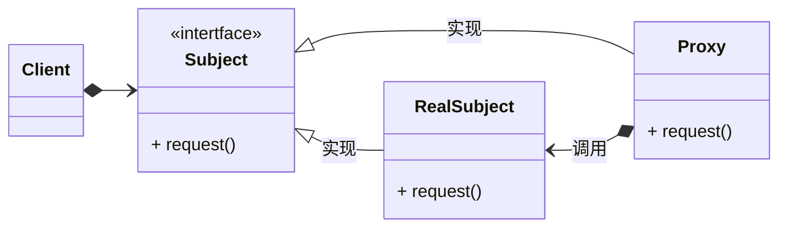

## 应用场景

代理模式是使用一个与目标对象外观完全一样的对象来用用作中间通信.

与适配器不同, 适配器的作用是让一边的接口与另一边进行适配, 也就是改变了目标对象的外观.

而对代理对象的操作与直接对目标操作没有任何区别.

代理模式最大的作用就是解决在直接操作目标对象时的一些条件限制. 比如加速代理, 梯子代理等等.

或者通过延迟加载降低通信频率, 减少资源消耗, 如ORM相关的对象等等.



## 简单的python实现

```python
from abc import ABC, abstractmethod
from pathlib import Path
import os
import tracemalloc


class Books(ABC):

    @abstractmethod
    def show(self):
        pass

    @abstractmethod
    def get_book_name(self):
        pass


class Ebook(Books):

    def __init__(self, name, path):
        self.__name = name
        self.__content = Path(path).read_text(encoding='utf-8')

    def show(self):
        print(f"Content of book:{self.__name}`:\n\t{self.__content[0:20]}")

    def get_book_name(self):
        return self.__name


class EBookProxy(Books):

    def __init__(self, name, path):
        self.__name = name
        self.__path = path
        self.__ebook = None

    def show(self):
        if self.__ebook is None:
            self.__ebook = Ebook(self.__name, self.__path)

        self.__ebook.show()

    def get_book_name(self):
        return self.__name


class BookStore:

    def __init__(self, *books):
        self.__books = {book.get_book_name(): book for book in books}

    def book_list(self):
        print(self.__books.keys())

    def show_book(self, name):
        if name in self.__books:
            self.__books[name].show()


if __name__ == "__main__":

    def memory_test(clz):
        tracemalloc.start()

        books_dir = os.path.join(
            os.path.abspath(os.path.curdir),
            'ebooks')

        book_list = os.listdir(books_dir)

        books = [clz(name, os.path.join(books_dir, name))
                 for name in book_list]

        store = BookStore(*books)

        store.book_list()
        store.show_book("book 2.txt")
        snapshot = tracemalloc.take_snapshot()
        stats = snapshot.statistics('lineno')

        for stat in stats:
            result = str(stat).rsplit('/', 1)[-1]
            print(f">> {result}")

        tracemalloc.stop()

    memory_test(Ebook)
    print("----")
    memory_test(EBookProxy)
```

最终输出结果:

```bash
dict_keys(['book 1.txt', 'book 2.txt', 'book 3.txt'])
Content of book:book 2.txt`:
## 应用场景

代理模式是使用一个与目
>> pathlib.py:1059: size=14.8 KiB, count=3, average=5068 B
>> proxy_pattern.py:83: size=968 B, count=7, average=138 B
>> proxy_pattern.py:86: size=320 B, count=2, average=160 B
>> proxy_pattern.py:81: size=209 B, count=4, average=52 B
>> pathlib.py:1044: size=201 B, count=3, average=67 B
>> <frozen posixpath>:88: size=111 B, count=1, average=111 B
>> proxy_pattern.py:36: size=48 B, count=1, average=48 B
>> pathlib.py:540: size=48 B, count=1, average=48 B
>> pathlib.py:496: size=48 B, count=1, average=48 B
----
dict_keys(['book 1.txt', 'book 2.txt', 'book 3.txt'])
Content of book:book 2.txt`:
## 应用场景

代理模式是使用一个与目
>> pathlib.py:1059: size=5068 B, count=1, average=5068 B
>> proxy_pattern.py:83: size=968 B, count=7, average=138 B
>> <frozen posixpath>:88: size=477 B, count=4, average=119 B
>> proxy_pattern.py:86: size=312 B, count=2, average=156 B
>> proxy_pattern.py:51: size=296 B, count=2, average=148 B
>> proxy_pattern.py:81: size=209 B, count=4, average=52 B
>> pathlib.py:1044: size=67 B, count=1, average=67 B
```

可以看到, 两种方式都能够正确执行程序, 但在通过代理进行延迟加载之后, 最大内存消耗的对象体积从`14.8K`降低到了`0.5k`.
