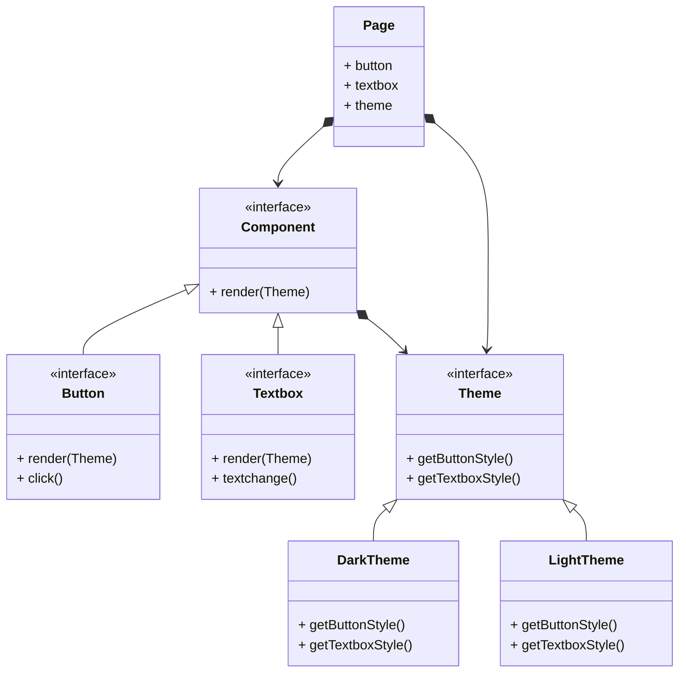

## 应用场景

> Provide an interface for creating families of related objects.
>
{: .prompt-info}

抽象工厂和工厂方法基本没有什么关系.

工厂方法的作用是返回一个接口的实现对象, 子类可以自由决定具体使用什么对象.

而抽象工厂则是一个返回相关对象的接口. 比如一套UI主题系统, 每套主题都包含自己的Button, Listbox, Textbox等UI样式. 不会有人希望在Light皮肤中得到一个Dark按钮.

抽象工厂就是为了解决这一问题.



在这个结构中, Page包含的按钮和文本框便是通过Theme的实现类获得统一的样式.

## 简单的python实现

```python
from abc import ABC, abstractmethod


class Theme(ABC):

    @abstractmethod
    def button_style(self):
        pass

    @abstractmethod
    def textbox_style(self):
        pass


class Component(ABC):

    @abstractmethod
    def render(self, theme: Theme = None):
        pass


class Button(Component):

    def render(self, theme: Theme = None):
        print(f'Render button use style: {theme.button_style()}')


class Textbox(Component):

    def render(self, theme: Theme = None):
        print(f'Render textbox use style: {theme.textbox_style()}')


class DarkTheme(Theme):

    def button_style(self):
        return 'dark button'

    def textbox_style(self):
        return 'dark textbox'


class LightTheme(Theme):

    def button_style(self):
        return 'light button'

    def textbox_style(self):
        return 'light textbox'


if __name__ == "__main__":

    t = DarkTheme()
    btn = Button()
    textbox = Textbox()
    btn.render(t)
    textbox.render(t)
```
