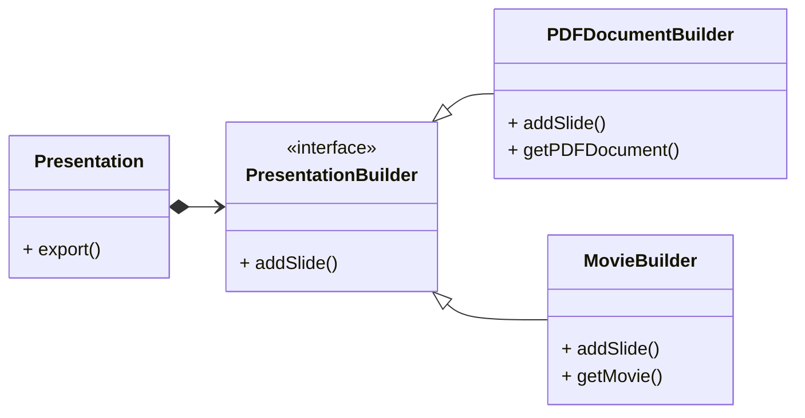

## 应用场景

> To separate the construction of an object from its representation.
>
{: .prompt-info}

顾名思义, 将对象的结构与呈现形式进行分离.

经常会有将数据或对象从一种结果导出为其他呈现形式的需求, 比如PPT转PDF, 表格转图表等等.



## 简单的python实现

```python
class Slide:

    def __init__(self, text):
        self.text = text


class PresentationBuilder(ABC):

    @abstractmethod
    def add_slide(self, slide: Slide):
        pass

    @abstractmethod
    def get_result(self):
        pass


class PDFBuilder(PresentationBuilder):

    def __init__(self):
        self.document = []

    def add_slide(self, slide: Slide):
        self.document.append(slide)

    def get_result(self):
        return self.document


class MovieBuilder(PresentationBuilder):

    def __init__(self):
        self.frames = []
        self.duration = []

    def add_slide(self, slide: Slide):
        self.frames.append(slide)
        self.duration.append(randint(1, 3))

    def get_result(self):
        return list(zip(self.frames, self.duration))


class Presentation:

    def __init__(self, *slides: Slide):
        self.slides = slides or []

    def add_slide(self, slide: Slide):
        self.slides.append(slide)

    def remove_slide(self, index: int):
        self.slides.remove(index)

    def export(self, builder: PresentationBuilder):

        for slide in self.slides:
            builder.add_slide(slide)


if __name__ == "__main__":

    s = [f"slide {i}" for i in range(3)]
    p = Presentation(*s)
    pdf = PDFBuilder()
    movie = MovieBuilder()
    p.export(pdf)
    p.export(movie)
    print(pdf.get_result())
    print(movie.get_result())
```

输出结果:

```bash
['slide 0', 'slide 1', 'slide 2']
[('slide 0', 2), ('slide 1', 1), ('slide 2', 1)]
```
